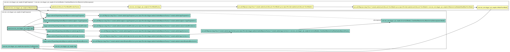

# dagger.spi Sample

`dagger.spi` is still experimental. This repository won't work different versions of dagger. I checked `2.15` only.

## Generate graph image

### Install tool

```
$ brew install graphviz
```

### Build

```
$ ./gradlew clean assembleDebug
```

### Generate image

```
$ dot -Tpng app/build/intermediates/classes/debug/com/star_zero/dagger_spi_sample/di/AppComponent.dot -o graph-image/AppComponent.png
```

## Sample Image

